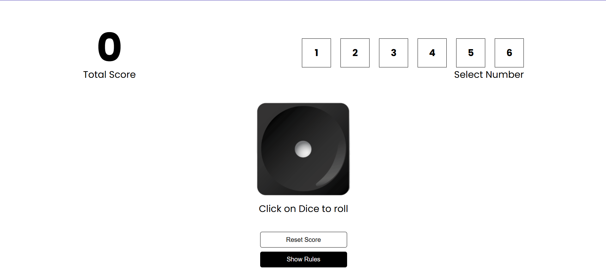

# Roller Dice Game 🎲


## INNER IMAGE:



Welcome to **Roller Dice Game**, an engaging and interactive web-based dice-rolling game. Built with the modern **React + Vite** stack, this project showcases a lightweight and high-performance frontend application.

## 🚀 Live Demo

Explore the game live here: [Roller Dice Game](https://rollerdice-game.netlify.app/)

## 🛠 Features

- 🎲 **Dice Rolling**: Click a button to roll the dice and see the outcome instantly.
- ⚡ **Real-Time Updates**: Responsive and smooth UI updates.
- 🖥️ **Responsive Design**: Optimized for desktop and mobile devices.
- 🚀 **Modern Tech**: Developed using cutting-edge tools and libraries.

## ⚙️ Tech Stack

- **React**: Component-based frontend framework.
- **Vite**: High-performance build tool with fast Hot Module Replacement (HMR).
- **ESLint**: Enforces clean and maintainable code practices.
- **Netlify**: Ensures fast and seamless deployment.

## ✨ Vite Plugins Used

This project leverages official Vite plugins for enhanced development experience:

- **[@vitejs/plugin-react](https://github.com/vitejs/vite-plugin-react)**: Enables Fast Refresh using Babel.
- **[@vitejs/plugin-react-swc](https://github.com/vitejs/vite-plugin-react-swc)**: Offers Fast Refresh with the speed of SWC.

## 📦 Getting Started

### Prerequisites

- Ensure you have [Node.js](https://nodejs.org/) installed (latest LTS version recommended).

### Installation

1. Clone the repository:
   ```bash
   git clone https://github.com/your-username/roller-dice-game.git
   cd roller-dice-game
2. Install dependencies:
   npm install
3. Start the development server:
   npm run dev
4. Open your browser and navigate to http://localhost:3000 to view the app.

## 📜 Scripts
npm run dev: Starts the development server with HMR.
npm run build: Builds the application for production.
npm run preview: Serves the production build locally.
npm run lint: Runs ESLint for code quality checks.

## 🤝 Contributing
We welcome contributions! Here's how you can help:

1. Fork the repository.
2. Create a new branch (git checkout -b feature-name).
3. Commit your changes (git commit -m 'Add new feature').
4. Push to the branch (git push origin feature-name).
5. Open a pull request.

## 📄 License
This project is licensed under the MIT License. See the LICENSE file for details.
